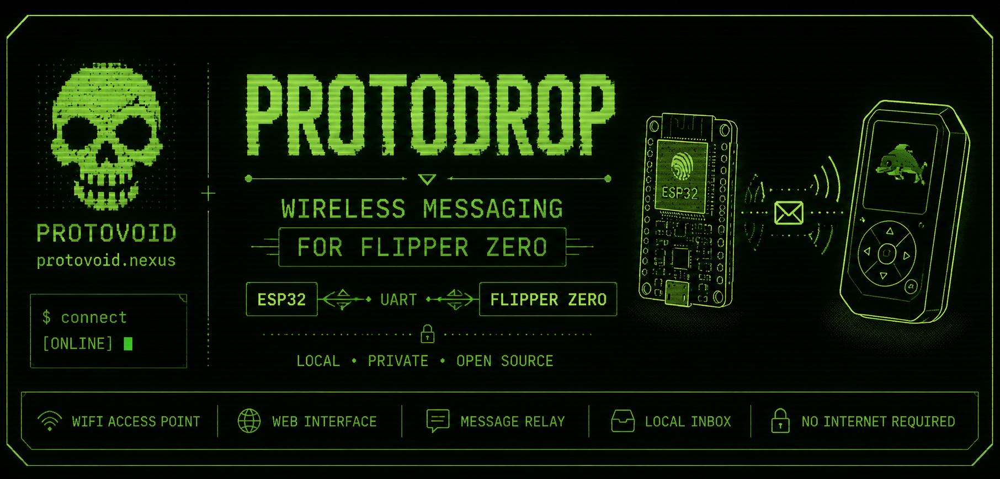

<p align="center">
  
</p>

# ProtoDrop
Wireless Messaging for Flipper Zero 
Phone / Browser ⇄ ESP32 ⇄ UART ⇄ Flipper Zero
````bash
$ protodrop --status

[ONLINE]  WiFi AP Started
[ONLINE]  ESP32 Web Server Ready
[ONLINE]  UART Link Active
[READY]   Flipper Inbox Listening

Waiting for messages...
````

**ProtoDrop** is a Flipper Zero + ESP32 messaging project that lets a user connect to a local WiFi access point, send a message through a simple web interface, and have that message delivered directly to the Flipper Zero.

---

## System Diagram

```text
┌──────────────┐
│ Phone/Laptop │
│ Web Browser  │
└──────┬───────┘
       │
       │ WiFi AP
       ▼
┌──────────────┐
│    ESP32     │
│ Web Server   │
│ Message RX   │
└──────┬───────┘
       │
       │ UART
       ▼
┌──────────────┐
│ Flipper Zero │
│ ProtoDrop UI │
│ Local Inbox  │
└──────────────┘
```

---

## Features

| Feature               | Description                                   | Status         |
| --------------------- | --------------------------------------------- | -------------- |
| WiFi Access Point     | ESP32 hosts a local network for message entry | ✅ Working      |
| Web Message Form      | Simple browser page for sending messages      | ✅ Working      |
| UART Communication    | ESP32 sends messages to Flipper over UART     | ✅ Working      |
| Flipper Inbox         | Messages are displayed inside the Flipper app | ✅ Working      |
| Local Message Storage | Messages can be saved and reviewed later      | ✅ Working      |
| Message Management    | Read, delete, and wipe stored messages        | ✅ Working      |
| New Message Alert     | Flipper can notify when a message is received | 🚧 Planned     |
| Vibration Feedback    | One short vibration on new message            | 🚧 Planned     |
| Polished UI           | Cleaner Flipper interface and menu flow       | 🚧 In Progress |
| File Transfer         | Ability to transfer files to Flipper Zero     | 🔮 Future      |
| Encryption            | Optional secure message handling              | 🔮 Future      |

---

## Terminal Demo

```bash
$ protodrop listen

[OK] ProtoDrop initialized
[OK] Storage mounted
[OK] UART ready
[OK] Waiting for ESP32

> incoming message detected
> saving to inbox
> alerting user

[NEW MESSAGE] Inbox count: 1
```

---

## Project Goal

ProtoDrop is designed as a small, self-contained local messaging system for the Flipper Zero.
The goal is to keep it simple, portable, and useful without needing internet access or outside infrastructure.

